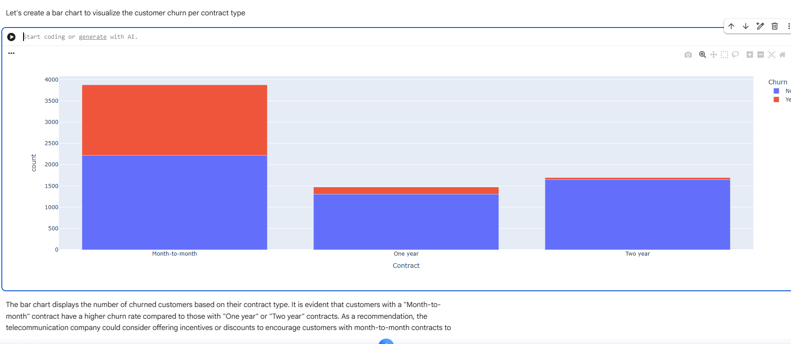
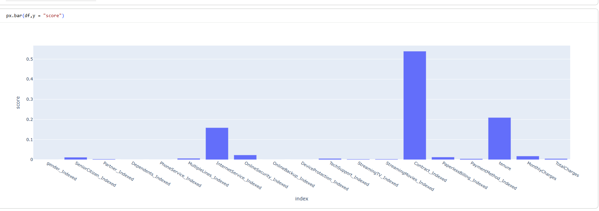

# Customer Churn Prediction with PySpark

## About
An end-to-end distributed machine learning project using PySpark to analyze telecom customer behavior and predict customer churn. Built with Apache Spark MLlib, this project demonstrates scalable data preprocessing, distributed feature engineering, Decision Tree classification, ROC-AUC evaluation, and hyperparameter tuning.

## Problem Statement
Customer churn represents a critical revenue challenge in subscription-based services, where customer acquisition costs substantially outweigh retention investments. Identifying customers at high risk of churning allows businesses to intervene proactively with targeted retention campaigns, customized incentives, and service enhancements before revenue loss occurs.

## Screenshots

### Churn Analysis


### Feature Importance


## Project Highlights
- **Distributed Computing Pipeline**: Leveraged PySpark and Apache Spark for distributed data preprocessing, scaling, and machine learning.
- **Exploratory Data Analysis**: Assessed numerical distributions, multi-feature correlation matrices, and categorical churn patterns using Pandas, Matplotlib, and Plotly.
- **Data Cleaning & Preprocessing**: Imputed missing numerical data with Spark's `Imputer` (mean strategy) and filtered extreme tenure outliers.
- **Modular Feature Engineering**: Transformed categorical variables using `StringIndexer` and scaled continuous variables using `VectorAssembler` and `StandardScaler`.
- **Systematic Model Tuning**: Evaluated Decision Tree performance across `maxDepth` values (2 to 20) to analyze generalization, tree complexity, and overfitting.
- **Interpretability & Feature Importance**: Extracted tree feature importances to highlight the key business factors driving customer attrition.

## Dataset
The analysis is based on telecom customer records loaded from `dataset.csv`, consisting of 7,043 rows and 21 columns:
- **Demographic Information**: `gender`, `SeniorCitizen`, `Partner`, `Dependents`
- **Subscribed Services**: `PhoneService`, `MultipleLines`, `InternetService`, `OnlineSecurity`, `OnlineBackup`, `DeviceProtection`, `TechSupport`, `StreamingTV`, `StreamingMovies`
- **Account & Billing Details**: `tenure` (months with the company), `Contract` (Month-to-month, One year, Two year), `PaperlessBilling`, `PaymentMethod`, `MonthlyCharges`, `TotalCharges`
- **Target Label**: `Churn` (`Yes` / `No`, indicating customer cancellation)

## Exploratory Data Analysis
- **Distribution Analysis**: Plotted histograms for continuous variables (`tenure`, `MonthlyCharges`, `TotalCharges`) to understand spread, skewness, and value ranges.
- **Correlation Analysis**: Evaluated Pearson correlation coefficients between numerical attributes:
  - `tenure` and `TotalCharges` exhibited a strong positive correlation (**0.81**).
  - `MonthlyCharges` and `TotalCharges` showed moderate correlation (**0.65**).
  - `tenure` and `MonthlyCharges` displayed low correlation (**0.24**).
- **Missing Value Audit**: Identified 11 missing values isolated strictly to `TotalCharges`, with 0 null values across all other attributes.
- **Contract Type & Churn**: Visualized churn distribution across contract terms, observing that month-to-month customers churned at significantly higher rates than those under one-year or two-year commitments.

## Data Preprocessing
- **Missing Value Imputation**: Handled the 11 missing values in `TotalCharges` using PySpark's `Imputer` configured with `mean` strategy.
- **Outlier Filtering**: Detected an anomalous record with tenure exceeding 100 months (`tenure = 458`) and filtered it using `data.filter(data.tenure < 100)`.
- **Dataset Partitioning**: Split data into training (70% — 4,931 rows) and test sets (30% — 2,112 rows) using `data.randomSplit([0.7, 0.3], seed=100)`.

## Feature Engineering
Features were transformed into model-ready vectors through a structured pipeline:
1. **Categorical Encoding**: Applied `StringIndexer` to convert all string categorical columns into numeric indices (`gender_Indexed`, `Contract_Indexed`, `InternetService_Indexed`, etc.).
2. **Numerical Assembly & Standardization**:
   - Assembled `tenure`, `MonthlyCharges`, and `TotalCharges` into `numerical_features_vector` via `VectorAssembler`.
   - Standardized features to zero mean and unit variance using `StandardScaler(withMean=True, withStd=True)` into `numerical_features_scaled`.
3. **Categorical Feature Assembly**: Combined all indexed categorical features (excluding `customerID_Indexed` and `Churn_Indexed`) into `categorical_features_vector` using `VectorAssembler`.
4. **Final Vector Assembly**: Merged `categorical_features_vector` and `numerical_features_scaled` into `final_feature_vector` via `VectorAssembler`.

## Model
The classification model was built using PySpark MLlib's **Decision Tree Classifier** (`DecisionTreeClassifier`):
- **Model Type**: Decision Tree Classifier
- **Features Column**: `final_feature_vector`
- **Label Column**: `Churn_Indexed`
- **Baseline maxDepth**: `6`
- **Suitability**: Decision Trees naturally accommodate mixed data types (continuous scaled values and indexed categoricals), capture non-linear interactions without complex transformations, and provide transparent decision logic via feature importance calculation.

## Model Evaluation
Model performance was evaluated on the test set using `BinaryClassificationEvaluator` measuring the Area Under ROC (ROC-AUC):
- **Baseline Test ROC-AUC**: `0.6941`
- **Baseline Training ROC-AUC**: `0.7096`

## Hyperparameter Tuning
An empirical experiment evaluated `maxDepth` parameter values across the range `[2, 3, 4, 5, 6, 7, 8, 9, 10, 11, 12, 13, 14, 15, 16, 17, 18, 19, 20]`:
- **Optimal Test ROC-AUC**: **`0.7789`** (Training: `0.7790`) achieved at **`maxDepth = 2`**.
- **Secondary Peak**: **`0.7732`** achieved at **`maxDepth = 7`** (Training: `0.7987`).
- **Overfitting Analysis**:
  - Beyond `maxDepth = 7`, training performance rose steadily up to **`0.9918`** at `maxDepth = 20`.
  - Concurrently, test performance dropped from `0.7732` to **`0.6968`** at `maxDepth = 20`.
  - The evaluation demonstrates that constrained tree depth regularizes the model effectively, while excessive depth memorizes training noise and hurts out-of-sample generalization.

## Feature Importance
Feature importance scores extracted directly from the Decision Tree model identified the most influential churn indicators:
- **`Contract_Indexed`**: **`0.5391`** (~53.9%) — the primary factor influencing customer attrition.
- **`tenure`**: **`0.2093`** (~20.9%) — customer lifespan strongly governs retention probability.
- **`InternetService_Indexed`**: **`0.1587`** (~15.9%) — internet connection type significantly impacts churn behavior.
- **`OnlineSecurity_Indexed`**: **`0.0228`** (~2.3%)
- **`MonthlyCharges`**: **`0.0175`** (~1.7%)
- **`PaperlessBilling_Indexed`**: **`0.0124`** (~1.2%)
- **`SeniorCitizen_Indexed`**: **`0.0115`** (~1.2%)

## Key Insights
1. **Contract Structure is Paramount**: Contract type dominates model decisions with 53.9% relative importance; month-to-month contracts exhibit significantly higher churn than one-year or two-year contracts.
2. **Tenure Protects Against Churn**: Account tenure is the second strongest predictor (20.9% importance), showing that customer flight risk is concentrated in earlier subscription stages.
3. **Internet Service Type Affects Retention**: Internet service accounts for 15.9% of model importance, indicating that plan tiers and connection technology directly correlate with user satisfaction and churn.
4. **Regularization via Tree Depth is Essential**: Model tuning showed that shallow trees (`maxDepth = 2`, Test ROC-AUC: `0.7789`) generalized substantially better than complex trees (`maxDepth = 20`, Test ROC-AUC: `0.6968`), which overfit the training set.

## Tech Stack

Python
PySpark
Apache Spark
Pandas
Matplotlib
Plotly
Google Colab / Jupyter Notebook

## Workflow

Data
↓
EDA
↓
Preprocessing
↓
Feature Engineering
↓
String Indexing
↓
Vector Assembly
↓
Scaling
↓
Train/Test Split
↓
Decision Tree
↓
Evaluation
↓
Hyperparameter Tuning

## How to Run

```bash
git clone https://github.com/mrtej117/pyspark-customer-churn-analysis.git
cd pyspark-customer-churn-analysis
pip install pyspark pandas matplotlib plotly
```

Open and run `churn.ipynb` using Jupyter Notebook or Google Colab:

```bash
jupyter notebook churn.ipynb
```
