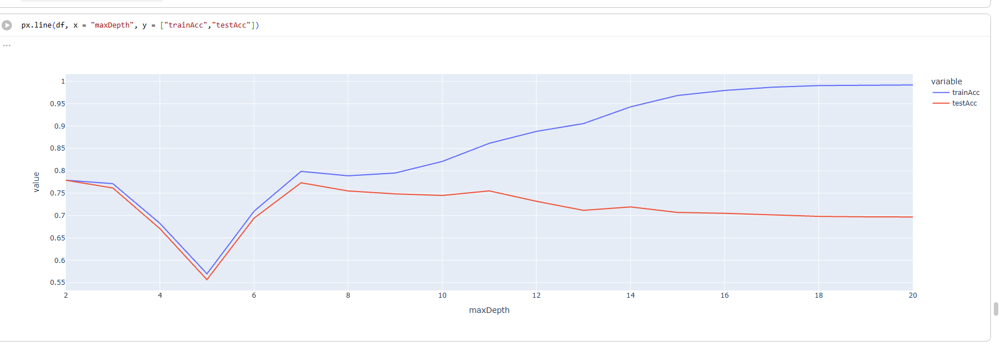

# Customer Churn Prediction with PySpark

## About

A machine learning project using PySpark to analyze customer data and predict customer churn. The project covers data preprocessing, feature engineering, Decision Tree classification, and model evaluation.

## Tech Stack

Python · PySpark · Apache Spark · Pandas · Matplotlib · Plotly

## Workflow

Data → EDA → Preprocessing → Feature Engineering → String Indexing → Vector Assembly → Scaling → Train/Test Split → Decision Tree → Evaluation → Hyperparameter Tuning

## Model

A PySpark Decision Tree Classifier is used to predict whether a customer is likely to churn based on customer and service-related features.

## Results

- Evaluated using ROC-AUC on training and test data.
- Tested different `maxDepth` values to study model performance and overfitting.
- Feature importance was analyzed to identify influential churn factors.

## Screenshots

### Churn Analysis


### Feature Importance


### Hyperparameter Tuning


## How to Run

```bash
# Clone the repository
git clone https://github.com/mrtej117/pyspark-customer-churn-analysis.git
cd pyspark-customer-churn-analysis

# Install dependencies
pip install pyspark pandas matplotlib plotly

# Run the notebook
jupyter notebook churn.ipynb
```
